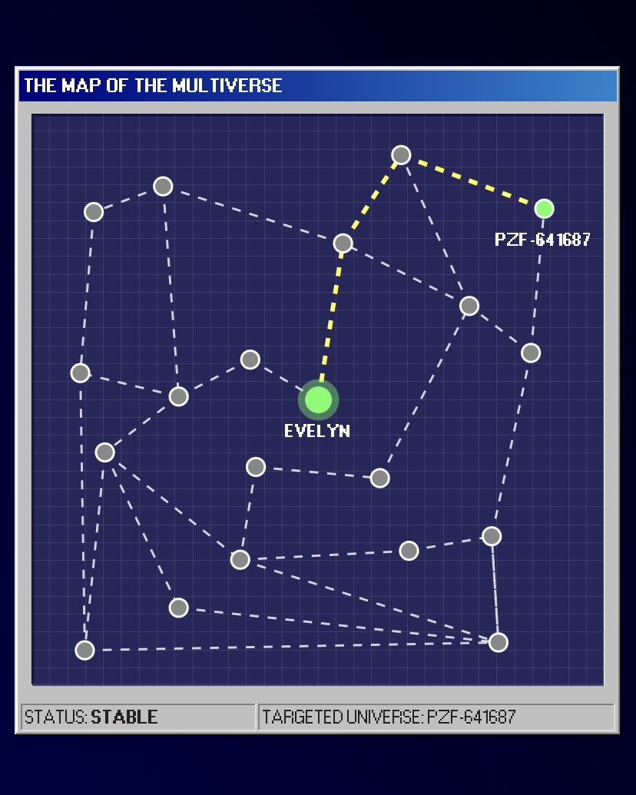

# [eeaao-app](https://eeaao.tomchan.me/)

A fictional map of the multiverse with Windows 98 style UI, inspired by the movie [Everything Everywhere All at Once](https://www.imdb.com/title/tt6710474/)

## Description

This is a simple web app showing an interactive map that lets you click one of the universes to find the shortest path from the main universe (with A* Search Algorithm).

## Technologies

- [Vite](https://vitejs.dev/)
- [React](https://react.dev/)
- [98.css](https://jdan.github.io/98.css/)
- [Delaunator](https://github.com/mapbox/delaunator)
- [Nano ID](https://github.com/ai/nanoid)
- [Classnames](https://github.com/JedWatson/classnames)
- [Lodash](https://lodash.com/)

## Scripts

```bash
npm install
npm run dev
```

Dev server runs on port `9527`. Production build: `npm run build` then `npm run preview`.

## Screenshot


